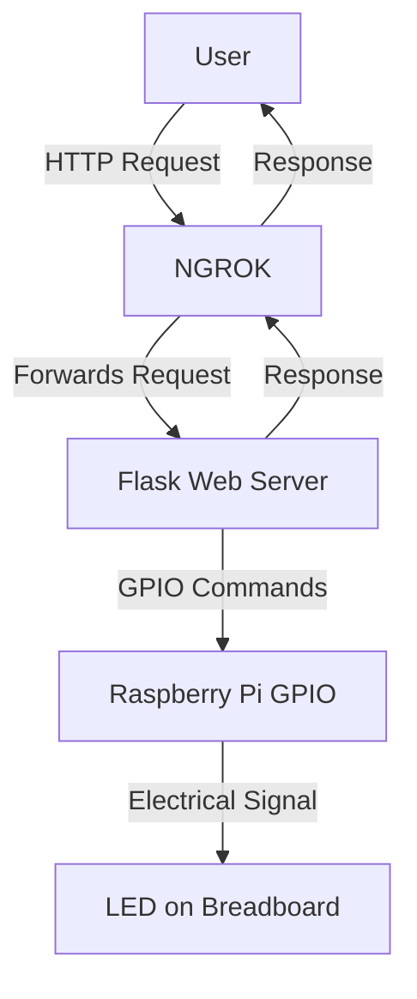
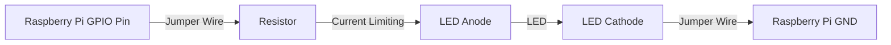

# Web-Controlled LED System Project Plan

## 1. System Architecture



## 2. Hardware Setup

### Components Required:
- Raspberry Pi 4
- Breadboard
- LED(s)
- Resistor(s) (typically 220-330 ohms for LEDs)
- Jumper wires

### Circuit Diagram:


### Physical Connection Steps:
- Connect a GPIO pin (e.g., GPIO 18) to a resistor on the breadboard
- Connect the resistor to the LED's anode (longer leg)
- Connect the LED's cathode (shorter leg) to a ground (GND) pin on the Raspberry Pi

## 3. Software Components

### Backend (Python/Flask):
- Flask web server to handle HTTP requests
- RPi.GPIO library to control GPIO pins
- API endpoints for:
  - Turning LED on
  - Turning LED off
  - Getting LED status

### Frontend (HTML/CSS/JavaScript):
- Simple webpage with toggle button
- JavaScript to make AJAX calls to the backend
- Real-time status display

### NGROK Setup:
- Configuration for exposing the local Flask server to the internet
- Security considerations

## 4. Implementation Plan

### Phase 1: Hardware Setup
1. Assemble the circuit on the breadboard
2. Test the LED connection using simple Python GPIO commands

### Phase 2: Backend Development
1. Set up a Flask application with the necessary routes
2. Implement GPIO control functions
3. Create API endpoints for LED control
4. Add error handling and logging

### Phase 3: Frontend Development
1. Design a simple, responsive web interface
2. Implement JavaScript for API communication
3. Add visual feedback for LED state

### Phase 4: NGROK Integration
1. Install and configure NGROK
2. Set up secure access
3. Test remote accessibility

### Phase 5: Testing and Refinement
1. Test all functionality locally
2. Test remote access via NGROK
3. Optimize for reliability and performance

## 5. Code Structure

```
project/
├── app.py              # Main Flask application
├── static/             # Static files
│   ├── css/
│   │   └── style.css   # Styling
│   └── js/
│       └── script.js   # Frontend JavaScript
├── templates/
│   └── index.html      # Main webpage
├── gpio_controller.py  # GPIO interaction logic
├── config.py           # Configuration settings
└── requirements.txt    # Python dependencies
```

## 6. Security Considerations

1. Implement authentication for the web interface
2. Use HTTPS for secure communication
3. Limit NGROK access with authentication
4. Consider rate limiting to prevent abuse

## 7. Future Expansion Possibilities

1. Multiple LED control
2. Scheduled on/off times
3. Mobile app integration
4. Integration with home automation systems